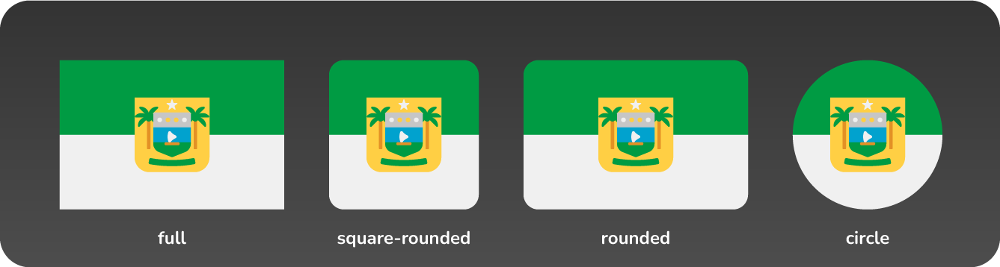
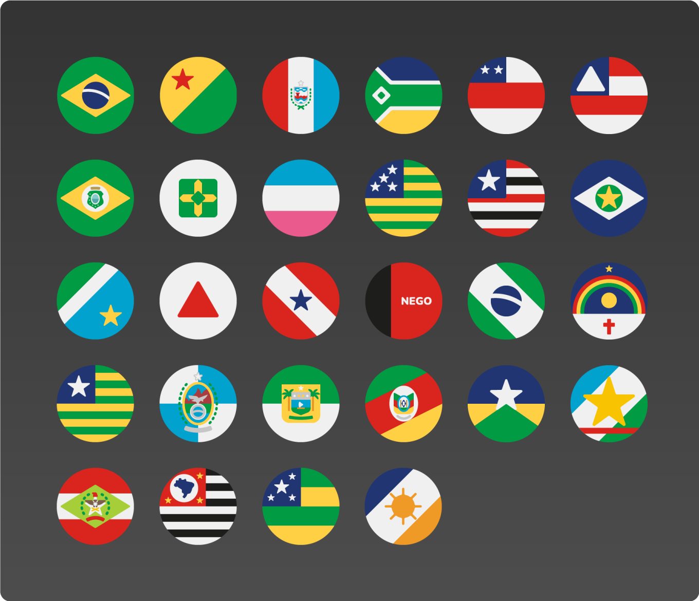
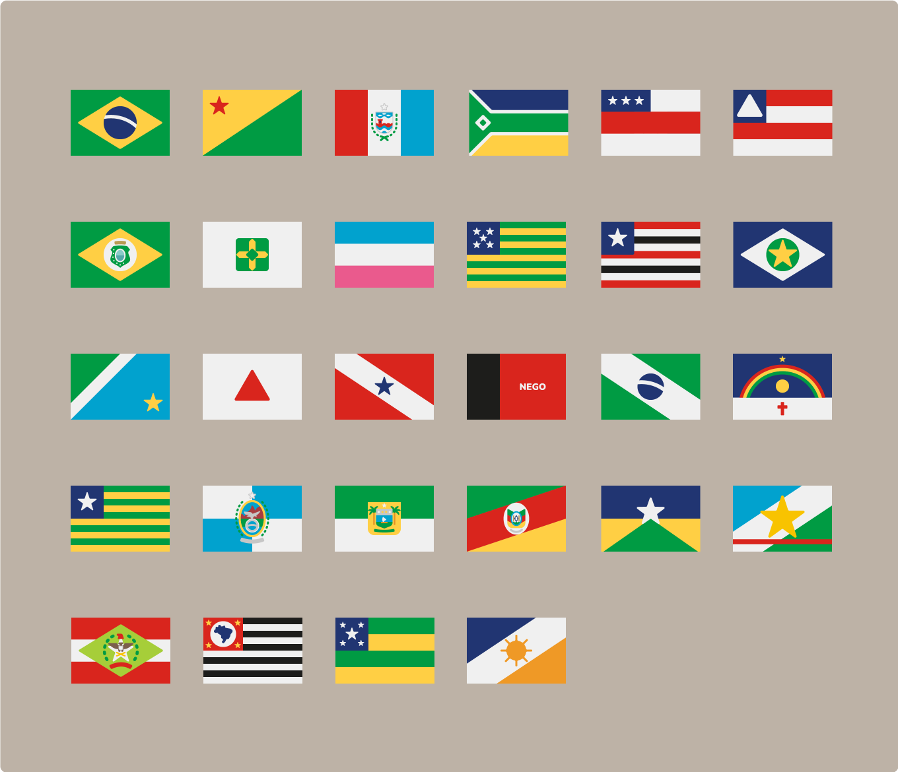

# Ícones de bandeiras de Estados do Brasil

## Brazil State Flags Icons

Pacote de ícones com bandeiras dos Estados brasileiros em estilo flat, normalizados, com padronização de cores e tamanhos.

## Features

-   4 estilos disponíveis
    -   2/3 com bordas retas
    -   2/3 com bordas arredondadas
    -   Quadrado com bordas arredondadas
    -   Circular

-   4 formatos disponíveis
    -   PDF
    -   SVG
    -   PNG com 200px de largura
    -   PNG com 800px de largura
-   Arquivos fontes produzidos no Adobe Illustrator inclusos na pasta src

## Os ícones

#### Formato 'square-rounded'

#### Formato 'circle'

#### Formato 'rounded'

#### Formato 'full'

